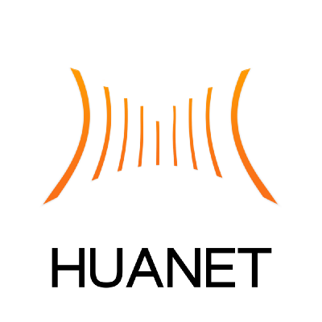

# HUI

An enterprise-class UI design language and Vue UI library.

[](https://travis-ci.org/HuaWangDongShi/HUI)
[](https://codecov.io/gh/HuaWangDongShi/HUI)
[](https://badge.fury.io/js/%40huanet%2Fhui)
[](https://www.npmjs.com/package/@huawangdongshi/hui)
[](https://www.npmjs.com/package/@huawangdongshi/hui)
[](https://github.com/semantic-release/semantic-release)
[](https://spectrum.chat/huanet)


| Project | Status | Description |
|---------|--------|-------------|
| [vue]                | [![vue-status]][vue-package] | Vue is a JavaScript library for building user interfaces. |


[vue]: https://github.com/vuejs/vue
[vue-status]: https://img.shields.io/badge/vue-2.6.11-orange?color=blue&style=flat-square
[vue-package]: https://npmjs.com/package/vue

## ✨ Features

- 🌈 Enterprise-class UI designed for web applications.
- 📦 A set of high-quality Vue components out of the box.
- ⚙️Whole package of design resources and development tools.
- 🌍 Internationalization support for dozens of languages.
- 🎨 Powerful theme customization in every detail. 
  
## 🖥 Environment Support

- Modern browsers and Internet Explorer 11
- Server-side Rendering

| [](http://godban.github.io/browsers-support-badges/)<br/>IE / Edge | [](http://godban.github.io/browsers-support-badges/)<br/>Firefox | [](http://godban.github.io/browsers-support-badges/)<br/>Chrome | [](http://godban.github.io/browsers-support-badges/)<br/>Safari | [](http://godban.github.io/browsers-support-badges/)<br/>Opera |
| --------- | --------- | --------- | --------- | --------- |
| IE11, Edge| last 2 versions| last 2 versions| last 2 versions| last 2 versions

## 📦 Install

[](https://www.npmjs.com/package/@huawangdongshi/hui)

## 🔨 Usage

```
import { HButton } from 'hui'; 

<h-button>hello world!</h-button>
```

## Changelog

Detailed changes for each release are documented in the [release notes](https://github.com/HuaWangDongShi/HUI/releases).


## License

[MIT](https://github.com/HuaWangDongShi/HUI/blob/master/LICENSE)

Copyright (c) 2020-present WangZhe
